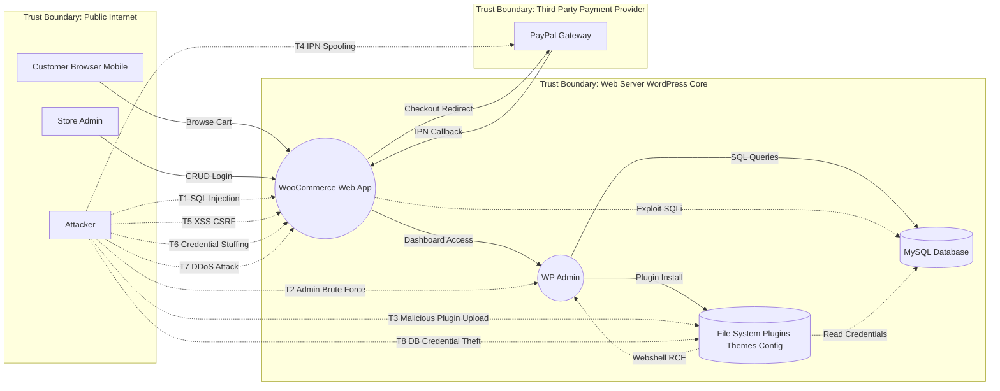

```mermaid
flowchart LR

%% =========================
%% TRUST BOUNDARIES
%% =========================

subgraph Internet["Trust Boundary: Public Internet"]
    Customer["Customer Browser Mobile"]
    Admin["Store Admin"]
    Attacker["Attacker"]
end

subgraph Server["Trust Boundary: Web Server WordPress Core"]
    WooCommerce(("WooCommerce Web App"))
    WPAdmin(("WP Admin"))
    DB[("MySQL Database")]
    FS[("File System Plugins Themes Config")]
end

subgraph PayPalZone["Trust Boundary: Third Party Payment Provider"]
    PayPal["PayPal Gateway"]
end

%% =========================
%% LEGITIMATE DATA FLOWS
%% =========================

Customer -->|Browse Cart| WooCommerce
Admin -->|CRUD Login| WooCommerce

WooCommerce -->|Dashboard Access| WPAdmin

WPAdmin -->|SQL Queries| DB
WPAdmin -->|Plugin Install| FS

WooCommerce -->|Checkout Redirect| PayPal
PayPal -->|IPN Callback| WooCommerce

%% =========================
%% ATTACK PATHS
%% =========================

Attacker -. T1 SQL Injection .-> WooCommerce
WooCommerce -. Exploit SQLi .-> DB

Attacker -. T2 Admin Brute Force .-> WPAdmin

Attacker -. T3 Malicious Plugin Upload .-> FS

Attacker -. T4 IPN Spoofing .-> PayPal

Attacker -. T5 XSS CSRF .-> WooCommerce

Attacker -. T6 Credential Stuffing .-> WooCommerce

Attacker -. T7 DDoS Attack .-> WooCommerce

Attacker -. T8 DB Credential Theft .-> FS

%% =========================
%% POST EXPLOITATION
%% =========================

FS -. Read Credentials .-> DB

FS -. Webshell RCE .-> WPAdmin
```
